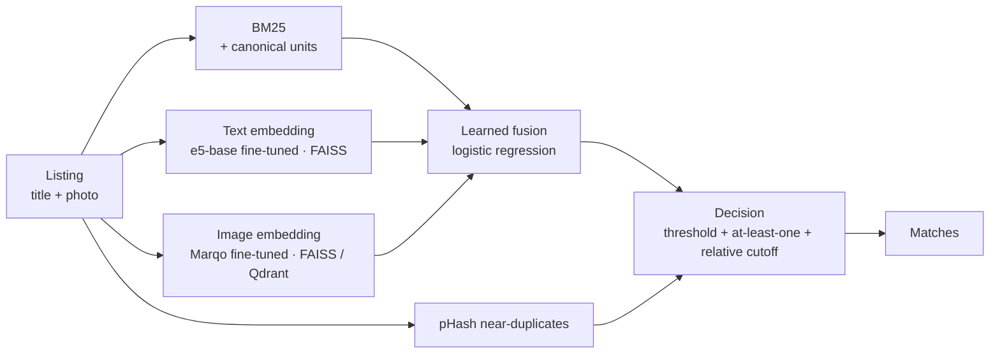

# MatchLens

**Is this the same product?** MatchLens decides whether two marketplace listings are the same product
from their titles and photos — and backs every design choice with a measured experiment.

Marketplaces get the same product listed many times by different sellers, with messy titles, mixed
languages and different photos. The hard part is look-alikes: the same phone in 64 GB and 128 GB reads
and looks almost identical, but it is a different product.

The point of this project is not one final score. It is a **ladder**: start from a simple baseline, add
one technique at a time, measure what each one gained or cost, and explain where the system still fails.

## Results

**Final pipeline: F1 0.798 on the held-out test split** (0.821 on validation), from 0.463 for "each
listing matches only itself". The ladder was frozen on validation, then the test split was unlocked
once; every test number below reuses its validation threshold unchanged.

Shopee – Price Match Guarantee, split by product. Validation: 3,366 query listings in a pool of 27,431
(validation + all training listings as distractors). Test: 6,819 queries in a pool of 30,884.

| # | Rung | Val F1 | **Test F1** | Test R@50 | Query cost on CPU |
|---|---|---|---|---|---|
| 0 | No model (each listing matches only itself) | 0.469 | 0.463 | — | — |
| 1 | BM25 on titles + global threshold | 0.679 | 0.677 | 0.911 | 1 ms |
| 1b | + canonical units (400 gram = 400gr = 0.4 kg) | 0.682 | 0.677 | 0.911 | 2 ms |
| 2 | + near-duplicate photos (pHash ≤ 6 bits) | 0.744 | 0.726 | 0.930 | 2 ms |
| 3 | *Comparison:* text embeddings alone — bge-m3 best of 5 (e5, mpnet, FastText trained here) | 0.673 | — | — | +274 ms to embed |
| 4 | *Comparison:* image embeddings alone — Marqo e-commerce best of 6 (SigLIP 2, DINOv2, SigLIP, CLIP, Swin V2) | 0.708 | — | — | +257 ms to embed |
| 5 | Fusion BM25 + bge-m3 + Marqo: learned weights, at-least-one-match, neighbour voting | 0.793 | 0.776 | 0.976 | 90 ms + ~530 ms to embed |
| 6 | + off-the-shelf cross-encoder reranker (bge-reranker-v2-m3) | 0.805 | — | — | +3.3 s |
| 7a | Text model fine-tuned on our data (e5-base, labels + hard negatives) | 0.804 | 0.779 | 0.982 | 90 ms + ~80 ms to embed |
| 7b | + small reranker fine-tuned on our pairs (MiniLM 118M) | 0.811 | — | — | +0.3 s |
| 7c | Image model fine-tuned on our data (Marqo, cross-fitted) | 0.819 | 0.797 | 0.971 | 90 ms + ~340 ms to embed |
| 7d | 7c + fine-tuned reranker | 0.819 | — | — | +0.3 s — **no gain, dropped** |
| **8** | **7c + relative cutoff = FINAL** | **0.821** | **0.798** | 0.971 | as 7c |

Rerankers (6, 7b, 7d) and the comparison rungs were not run on test: their pair scores exist only for
validation candidates, and none is in the final pipeline. Full write-up per rung, with failure
examples and bootstrap tests: [docs/ladder.md](docs/ladder.md).

**What the ladder shows**
- Cheap signals first: BM25 + photo hashes reach 0.73 test F1 with no neural network.
- Off-the-shelf models are *complementary*, not better: alone they score below BM25, fused they add +0.05.
- Fine-tuning our own models on our own mistakes (hard negatives) beat every larger off-the-shelf model
  and made the slow reranker unnecessary.
- The ordering of every rung holds on the untouched test split; test sits ~0.02 below validation (a
  larger pool and the usual optimism of tuning on validation).

## How it works



Fast retrievers find candidates (98% of true matches in the top 50); a small learned judge combines
their scores; decision rules turn scores into matches. Mistakes on the training split became hard
negatives for fine-tuning both encoders. Details: [docs/architecture.md](docs/architecture.md).

## Quickstart

Requires Python 3.12.

```bash
git clone https://github.com/stkef/matchlens.git
cd matchlens
python -m venv .venv
.venv/Scripts/python -m pip install -r requirements.txt      # macOS/Linux: .venv/bin/python
```

Try the whole pipeline on synthetic data (no download needed; the numbers mean nothing):

```bash
python -m matchlens.synthetic
python -m matchlens.data --csv data/synthetic/train.csv --out data/synthetic/split.csv
python -m matchlens.evaluate configs/smoke_bm25.toml --split val --results-dir data/synthetic/results
python -m pytest -q
```

## Reproduce

1. Accept the competition rules for "Shopee - Price Match Guarantee" on Kaggle and set up a Kaggle API
   token, then download:

   ```bash
   kaggle competitions download -c shopee-product-matching -p data/raw
   unzip data/raw/shopee-product-matching.zip -d data/raw
   ```

   Only `train.csv` has labels, so all splits are cut from it. Rung 1 needs only that file
   (`-f train.csv`, ~2.5 MB). The images are ~1.7 GB; keep them out of synced folders (OneDrive,
   Dropbox) and point `[data] csv` in the config at wherever they live.

2. Create the split (once; the manifest records the source file's SHA-256 and refuses to silently change):

   ```bash
   python -m matchlens.data
   ```

3. Run a rung:

   ```bash
   python -m matchlens.evaluate configs/rung01_bm25.toml --split val
   ```

   This writes `results/runs/rung01_bm25__val.json` (all metrics plus the threshold curve) and appends
   a row to `results/ledger.csv`.

## Documentation

| Doc | What's in it |
|---|---|
| [docs/PRD.md](docs/PRD.md) | Goals, scope, requirements, milestones, risks |
| [docs/architecture.md](docs/architecture.md) | Components, data flow, the retriever contract, how to add a rung |
| [docs/evaluation.md](docs/evaluation.md) | Splits, protocol and exact metric definitions |
| [docs/ladder.md](docs/ladder.md) | One entry per rung: hypothesis, change, result, verdict |

## Project layout

```
matchlens/
  data.py          listing loader, group-level split + manifest
  text.py          title decoding and tokenisation
  retrievers/      bm25, phash, dense (precomputed embeddings), fusion, rerank
  stores.py        vector stores: FAISS (text), Qdrant (images), numpy (exact reference)
  metrics.py       recall@k, MRR, competition F1 (+ at-least-one, relative cutoff), precision@recall
  threshold.py     threshold tuning on validation
  evaluate.py      the harness: one config in, one ledger row out
  fusion_train.py  learned fusion weights (train split, optional fold)
  mine_negatives.py, rerank_pairs.py, rerank_judge.py, fasttext_embed.py
  synthetic.py     fake Shopee-format data for tests
kaggle/            GPU notebooks: embeddings, reranking, fine-tuning (see docs/kaggle.md)
configs/           one TOML per rung; rung08_final.toml is the frozen pipeline
results/           ledger.csv + per-run JSON (committed)
tests/
docs/
```

## Status

**Ladder complete and frozen (2026-10-08).** Final pipeline `configs/rung08_final.toml`: test F1 0.798.
Possible next steps: a demo app and API, the 100-error label audit, and fine-tuning the text model with
cross-fitting as the image model was.

## Licence and data

Code: [MIT](LICENSE).

The Shopee dataset is © its owners and distributed by Kaggle under the competition's rules. It is
**not** included in this repository; download it yourself under those terms.
