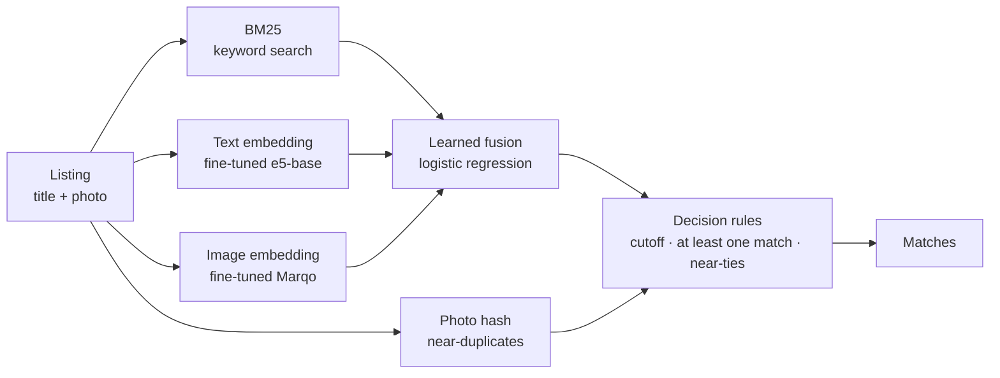

# MatchLens

**Finds the same product across marketplace listings, using titles and photos.**

Sellers list the same product many times with messy, mixed-language titles and different photos. The
hard cases are look-alikes: *"Sunlight dish soap, lime, 755 ml"* vs *"Sunlight dish soap, black seed,
755 ml"* share almost every word and look alike, but are different products.

MatchLens was built as an **experiment ladder**: start from a simple baseline, add one technique at a
time, measure each change, and keep it only if it helps.

**Result: F1 0.798 on a locked test split**, up from 0.677 for keyword search (BM25) and 0.463 for
doing nothing.

---

## Results

Data: [Shopee – Price Match Guarantee](https://www.kaggle.com/competitions/shopee-product-matching)
(34,250 listings, Indonesian/English), split **by product** into train / validation / test so no
product appears in two splits. Every listing is searched against a crowded pool that includes all
training listings, and F1 is the competition metric.

| Step | What was added | Val F1 | **Test F1** |
|---|---|---|---|
| 0 | Nothing (each listing matches only itself) | 0.469 | 0.463 |
| 1 | BM25 keyword search on titles | 0.679 | 0.677 |
| 2 | + perceptual photo hashes (copied photos) | 0.744 | 0.726 |
| 5 | + fusion of BM25, text embeddings and image embeddings (learned weights) | 0.793 | 0.776 |
| 7a | + text model fine-tuned on our data | 0.804 | 0.779 |
| 7c | + image model fine-tuned on our data | 0.819 | 0.797 |
| **8** | **+ adaptive cutoff → final pipeline** | **0.821** | **0.798** |

All choices were made on validation; the test split was unlocked **once**, at the end. Every gain
was checked with a paired bootstrap test.

## Key findings

- **Cheap signals go a long way.** Keyword search plus photo hashes reach 0.73 test F1 with no
  neural network.
- **Off-the-shelf AI models are complementary, not better.** Alone, the best text model (bge-m3)
  scored *below* BM25. Combined, they found 18% more correct matches than either one.
- **Domain beats generality.** A model trained on shop product photos (Marqo e-commerce) beat five
  general-purpose image models of similar size (CLIP, SigLIP, SigLIP 2, DINOv2, Swin V2).
- **Fine-tuning on our own mistakes won.** Training on "hard negatives" (look-alikes the system
  confused) took a small text model past a model twice its size, in 15 minutes on a free GPU. Labels
  were worth about 5× more than self-supervised training (SimCSE).
- **It made the expensive part unnecessary.** An off-the-shelf cross-encoder reranker added +0.011
  at 3.3 s per listing on CPU. Once the image model was fine-tuned, even a reranker fine-tuned on our
  own pairs added nothing, so the final pipeline has none.
- **Honest evaluation.** The fine-tuned models were cross-fitted (trained on one half of the products,
  judged on the other) and re-checked without training listings in the pool, to rule out memorisation.

## How it works



1. **Retrieve.** Three retrievers each propose candidates; together they find 98% of true matches
   in the top 50. Embeddings are searched with FAISS.
2. **Combine.** A small logistic regression, trained on the training split, turns the three scores
   into one probability.
3. **Decide.** A cutoff tuned on validation, plus two rules: every listing keeps its best match
   (every product has at least two listings), and near-ties of a confident match are accepted too.

## Tech

Python · NumPy · pandas · SciPy · PyTorch · sentence-transformers · open_clip · FAISS · Qdrant · BM25 ·
Kaggle GPUs for model work · pytest

## Run it

```bash
pip install -r requirements.txt
python -m pytest -q                                              # 19 tests
python -m matchlens.data --csv path/to/train.csv                 # group split + manifest
python -m matchlens.evaluate configs/rung01_bm25.toml --split val
```

Each config is one step of the ladder; [`configs/rung08_final.toml`](configs/rung08_final.toml) is the
final pipeline. Model training and embedding run as Kaggle notebooks in [`kaggle/`](kaggle). See
[docs/kaggle.md](docs/kaggle.md). Every run appends to [`results/ledger.csv`](results/ledger.csv).

## Limits

- Missed the planned target of +0.15 F1 over BM25: reached +0.142 on validation, +0.121 on test.
- Embedding a brand-new listing takes ~340 ms on CPU (photo model ~260 ms), over the 300 ms
  target without a GPU.
- Some remaining "errors" are label noise in the dataset (identical listings labelled as different
  products).

## More detail

| Doc | Contents |
|---|---|
| [docs/ladder.md](docs/ladder.md) | Every step: hypothesis, result, bootstrap test, failure examples |
| [docs/evaluation.md](docs/evaluation.md) | Splits, protocol, metric definitions |
| [docs/architecture.md](docs/architecture.md) | Components, vector stores, config format |
| [docs/PRD.md](docs/PRD.md) | Original plan, goals and risks |

## Licence

Code: [MIT](LICENSE). The Shopee data is not included; download it from Kaggle under the competition
rules.
