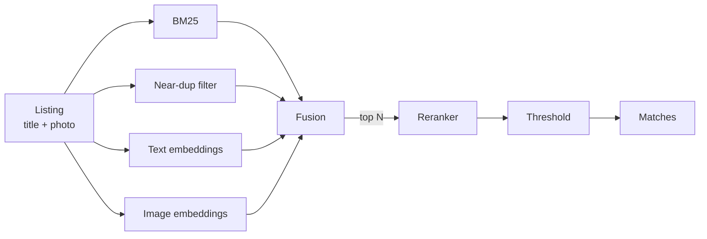

# MatchLens

**Is this the same product?** MatchLens decides whether two marketplace listings are the same product
from their titles and photos — and backs every design choice with a measured experiment.

Marketplaces get the same product listed many times by different sellers, with messy titles, mixed
languages and different photos. The hard part is look-alikes: the same phone in 64 GB and 128 GB reads
and looks almost identical, but it is a different product.

The point of this project is not one final score. It is a **ladder**: start from a simple baseline, add
one technique at a time, measure what each one gained or cost, and explain where the system still fails.

## Results

Validation split of Shopee – Price Match Guarantee: 3,366 query listings searched against a pool of
27,431 (validation + all training listings as distractors). The test split stays locked until the
ladder is frozen. For scale: predicting "each listing matches only itself" already scores **F1 0.469**.

| # | Rung | Recall@50 | F1 | p95 latency |
|---|---|---|---|---|
| 0 | No model (each listing matches only itself) | — | 0.469 | — |
| 1 | BM25 on titles + global threshold | 0.917 | 0.679 | 1.0 ms |
| 1b | + canonical units (400 gram = 400gr = 0.4 kg) | 0.918 | 0.682 | 1.8 ms |
| 2 | + near-duplicate photos (image phash within 6 bits) | 0.941 | **0.744** | 2.0 ms |
| 3 | *Comparison:* text embeddings alone (best: bge-m3) | 0.900 | 0.673 | 5 ms + 274 ms to embed the query on CPU |
| 4 | Image embeddings | — | — | — |
| 5 | Fusion (RRF → learned) | — | — | — |
| 6 | + Reranker on top N | — | — | — |
| 7 | Fine-tuned embeddings with hard negatives | — | — | — |
| 8 | Per-cluster / adaptive thresholds | — | — | — |

"—" means not run yet. Every row regenerates from one command (see [Reproduce](#reproduce)).

## How it works



Cheap retrievers aim for high recall; the expensive reranker only sees the top N, which keeps latency
down. Mistakes on the training split become hard negatives for fine-tuning the encoders.
Details: [docs/architecture.md](docs/architecture.md).

## Quickstart

Requires Python 3.12.

```bash
git clone https://github.com/stkef/matchlens.git
cd matchlens
python -m venv .venv
.venv/Scripts/python -m pip install -r requirements.txt      # macOS/Linux: .venv/bin/python
```

Try the whole pipeline on synthetic data (no download needed; the numbers mean nothing):

```bash
python -m matchlens.synthetic
python -m matchlens.data --csv data/synthetic/train.csv --out data/synthetic/split.csv
python -m matchlens.evaluate configs/smoke_bm25.toml --split val --results-dir data/synthetic/results
python -m pytest -q
```

## Reproduce

1. Accept the competition rules for "Shopee - Price Match Guarantee" on Kaggle and set up a Kaggle API
   token, then download:

   ```bash
   kaggle competitions download -c shopee-product-matching -p data/raw
   unzip data/raw/shopee-product-matching.zip -d data/raw
   ```

   Only `train.csv` has labels, so all splits are cut from it. Rung 1 needs only that file
   (`-f train.csv`, ~2.5 MB). The images are ~1.7 GB; keep them out of synced folders (OneDrive,
   Dropbox) and point `[data] csv` in the config at wherever they live.

2. Create the split (once; the manifest records the source file's SHA-256 and refuses to silently change):

   ```bash
   python -m matchlens.data
   ```

3. Run a rung:

   ```bash
   python -m matchlens.evaluate configs/rung01_bm25.toml --split val
   ```

   This writes `results/runs/rung01_bm25__val.json` (all metrics plus the threshold curve) and appends
   a row to `results/ledger.csv`.

## Documentation

| Doc | What's in it |
|---|---|
| [docs/PRD.md](docs/PRD.md) | Goals, scope, requirements, milestones, risks |
| [docs/architecture.md](docs/architecture.md) | Components, data flow, the retriever contract, how to add a rung |
| [docs/evaluation.md](docs/evaluation.md) | Splits, protocol and exact metric definitions |
| [docs/ladder.md](docs/ladder.md) | One entry per rung: hypothesis, change, result, verdict |

## Project layout

```
matchlens/
  data.py          listing loader, group-level split + manifest
  text.py          title decoding and tokenisation
  retrievers/      Retriever interface + implementations (bm25.py)
  metrics.py       recall@k, MRR, competition F1, precision@recall
  threshold.py     global threshold tuning on validation
  evaluate.py      the harness: one config in, one ledger row out
  synthetic.py     fake Shopee-format data for tests
configs/           one TOML per rung
results/           ledger.csv + per-run JSON (committed)
tests/
docs/
```

## Status

Rungs 1–3 are done. Best so far: F1 0.744 (rung 2). Rung 3 showed text embeddings alone score below BM25, but find different matches: together they get 18% more correct matches than either alone. Its failure analysis is in
[docs/ladder.md](docs/ladder.md). Next: rung 4 (image embeddings, on Kaggle), then rung 5 (fusion).

## Licence and data

Code: [MIT](LICENSE).

The Shopee dataset is © its owners and distributed by Kaggle under the competition's rules. It is
**not** included in this repository; download it yourself under those terms.
