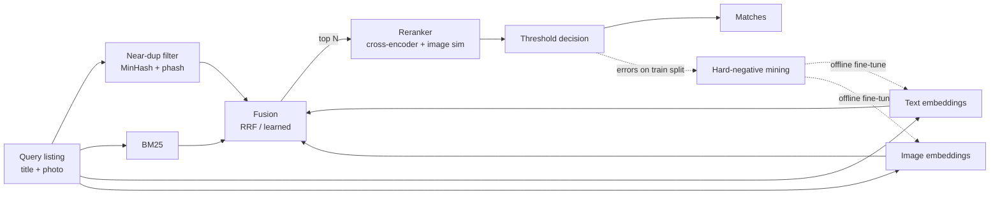

# MatchLens — PRD: Multimodal Product Matching Engine

Oct 5, 2026 · @stef · **v2** (revised after review; changes listed at the end)

## Overview

MatchLens decides whether two product listings are the same product, using their titles and photos. Every design choice is backed by a measured experiment on labelled data.

**Problem.** Marketplaces get the same product listed many times by different sellers, with messy titles, mixed languages and different photos. Matching them powers price comparison, duplicate removal and catalogue cleanup. It is hard because look-alikes are common: the same phone in 64 GB and 128 GB looks and reads almost identical, but it is a different product.

**What the project proves.** That I can take a fuzzy similarity problem and turn it into a measurable system. I start from a simple baseline, add one technique at a time, show what each one gained or cost, and explain where the system still fails. The interview story is the ladder of numbers, not the final score alone.

## What we're building

| Component | What it does |
|---|---|
| Near-duplicate filter | MinHash/LSH on titles and perceptual hashes on images; catches copies cheaply before any model runs |
| Lexical retriever | BM25 on titles; strong on model numbers and exact specs like "128GB" |
| Text embedding retriever | Dense vectors from a multilingual text model; finds matches worded differently |
| Image embedding retriever | CLIP-style image vectors; finds matches whose titles disagree but photos agree |
| Fusion | Merges candidate lists from all retrievers (reciprocal rank fusion first, a learned weighting later) |
| Reranker | Cross-encoder reads each query–candidate title pair together; its score is combined with image similarity as a feature, so photos still count after reranking. Rescores the top N (N = 20–50, chosen by the latency budget) |
| Match decision | Converts scores into yes/no with a threshold tuned on validation |
| Fine-tuned embeddings | Contrastive training with hard negatives mined from the system's own mistakes **on the train split** |
| Evaluation harness | One command runs any pipeline config on a split and logs recall@k, MRR, F1, precision@recall, latency and cost |
| Error-analysis view | Shows false matches and missed matches side by side, grouped by failure type |
| Demo app | Paste a title or upload a photo; see ranked matches, scores and which retriever found each |

## Goals and non-goals

**Goals**
- Build a measured ladder of at least eight pipeline configurations, each evaluated on the same held-out set.
- Show a clear gain from fine-tuned embeddings with hard negatives over off-the-shelf models.
- Explain every remaining failure category with real examples.
- Ship a demo anyone can try in under a minute, plus a write-up an interviewer can read in ten.

**Non-goals (v1)**
- Building a vector database (FAISS is used for indexing).
- Training an embedding model from scratch; only fine-tuning.
- Serving at marketplace scale (millions of listings, high QPS).
- Price comparison, crawling, or any live marketplace integration.

## Dataset and evaluation

**Primary dataset:** Shopee – Price Match Guarantee (Kaggle). Only `train.csv` carries labels (the Kaggle test set is hidden), so **all splits are cut from `train.csv`**: ~34k listings in ~11k product groups (confirm on download). Each listing has `posting_id`, `image`, `image_phash`, `title`, `label_group`. Titles mix Indonesian and English and contain escaped byte sequences (e.g. `\xe2\x80\x9c`) that must be decoded.

There is **no category field**. Anything per-category needs inferred categories (see rung 8).

**Splits.** Split by `label_group`, never by listing: 70% train (fine-tuning, hard-negative mining), 10% validation (thresholds, tuning, keep/drop decisions), 20% test (touched only for reported numbers, behind an explicit unlock flag). The split file is saved with a manifest (seed, fractions, SHA-256 of the source CSV) and never silently regenerated.

**Evaluation protocol.** Every listing in the evaluated split is a query. The candidate pool is that split **plus all training listings as distractors** (different products, so always wrong answers). Decided after rung 1: searching the val split alone (3.4k listings) gave BM25 F1 0.811, against 0.679 with distractors (27.4k), so the smaller pool flatters every model. Rung 7 also reports the no-distractor pool, because fine-tuning sees the training listings. A listing always matches itself; predicting only "self" scores F1 0.469 (the floor).

### Metrics

| Metric | Definition | What it answers |
|---|---|---|
| Recall@k (k = 10, 50) | For each query, true matches (excluding self) in the top-k, divided by `min(k, number of true matches)`; averaged over queries | Does candidate generation find the true matches at all? |
| MRR | 1 / rank of the first true match (excluding self), 0 if not retrieved | How high does the first true match rank? |
| Mean F1 per listing | Predicted set = self + candidates above threshold; truth = whole group including self; F1 = 2·overlap / (pred + truth), averaged over listings (the competition metric) | How good is the final match set? |
| Precision @ recall 0.9 | Pairwise precision over all retrieved (query, candidate) pairs at the loosest threshold reaching 90% pairwise recall; "n/a" if retrieval never reaches it | How many false matches at a recall a business would accept? |
| p50 / p95 latency | Wall-clock for one query, measured one at a time on a fixed sample of 200 queries, CPU | Is it usable interactively? |
| Cost per 1k queries | Mean CPU seconds per query × 1000 × an assumed hourly rate (stated in the config) | What would it cost to run? |

**Every rung reports F1.** Each rung tunes one global threshold on validation and applies it unchanged to test. Raw scores are made comparable across queries by normalising (e.g. BM25 score divided by the query's self-score; cosine similarity is already bounded).

**Reference point.** Top Kaggle solutions (ArcFace-trained image + text models, ensembles) reached roughly 0.76 F1 on the private leaderboard (approximate; confirm). The write-up quotes this so the ladder has an external anchor, while noting the different evaluation set.

**Stretch dataset.** A second, smaller test on a different catalogue checks that gains are not overfit to Shopee. Chosen only after its licence is checked.

## Experiment ladder

Rungs come in two kinds. **Comparison rungs** swap a component and are judged on their own. **Additive rungs** add one change to the previous best and are kept only if validation improves. Nothing is reported from test until the ladder is frozen.

| # | Kind | Rung | Hypothesis: what it should fix | R@50 | F1 | p95 |
|---|---|---|---|---|---|---|
| 1 | baseline | BM25 on titles (+ global threshold) | Baseline; strong on exact specs and model numbers | | | |
| 2 | additive | + MinHash / image-phash near-duplicates | Cheap wins on copied listings | | | |
| 3 | comparison | Text embeddings (2–3 multilingual models) | Paraphrases and mixed-language titles BM25 misses | | | |
| 4 | comparison | Image embeddings | Listings with useless titles but matching photos | | | |
| 5 | additive | Fusion of BM25 + best text + best image (RRF, then learned) | Each retriever catches what the others miss | | | |
| 6 | additive | + Reranker on top N (title cross-encoder + image-sim feature) | Near-misses ranked above true matches | | | |
| 7 | additive | Fine-tuned text + image towers with hard negatives | Look-alike variants (storage, colour, size) | | | |
| 8 | additive | Per-cluster thresholds (clusters inferred from embeddings) and per-query adaptive cut-offs | Converts good ranking into good yes/no decisions | | | |

The write-up shows the ladder as a chart, with one paragraph per rung on what changed and why.

## Architecture

Cheap retrievers aim for high recall; the expensive reranker only sees the top N, which keeps latency down. Errors on the **train** split become hard negatives that retrain the text and image encoders offline. Validation is never used for mining.

## Functional requirements

| ID | Requirement | Priority |
|---|---|---|
| FR-1 | Data loader with group-level train / validation / test split from `train.csv`, saved with a manifest and versioned | Must |
| FR-2 | Pluggable retrievers (BM25, MinHash, text embeddings, image embeddings) behind one interface returning per-query normalised scores | Must |
| FR-3 | Embedding cache so a model's vectors are computed once per dataset | Must |
| FR-4 | Fusion module: reciprocal rank fusion, then a learned weighting | Must |
| FR-5 | Reranker over the top N candidates, N configurable; image similarity available as a feature | Must |
| FR-6 | Threshold tuner that picks the cut-off on validation and reports precision/recall curves | Must |
| FR-7 | Fine-tuning script: contrastive loss, hard negatives mined from pipeline errors on the train split only | Must |
| FR-8 | Evaluation harness: one command per config, results appended to a ledger and chart; test split requires an explicit unlock flag | Must |
| FR-9 | Error-analysis view grouping false and missed matches by type | Must |
| FR-10 | Demo app (title or photo in, ranked matches out, with which retriever found each) | Must |
| FR-11 | HTTP API: `/match` for one listing, `/dedupe` for a batch | Should |
| FR-12 | Pluggable index backend (FAISS by default) | Could |

## Non-functional targets

Revisited after rung 1 (BM25: F1 0.679, recall@50 0.917, p95 1 ms on the distractor pool). Targets kept: +15 F1 means ≥ 0.83, ambitious but plausible on a 27k pool.

| Area | Target |
|---|---|
| Final F1 vs baseline | At least +15 points over BM25 alone |
| Fine-tuning gain | At least +3 F1 over the best off-the-shelf embeddings |
| Candidate recall@50 | ≥ 0.95 before reranking |
| Query latency | p95 ≤ 300 ms on CPU, reranker included. Reported both with and without the reranker; meeting it likely needs a MiniLM-size cross-encoder exported to ONNX (int8) and/or N = 20 |
| Training budget | Fine-tuning fits on a free Colab/Kaggle GPU in under 2 hours |
| Reproducibility | Every number in the README regenerates from one command with pinned versions and seeds |

## Milestones

Part-time weeks. If a gate is missed, later milestones move out rather than evaluation being cut.

| Week | Milestone | Gate |
|---|---|---|
| 1 | Repo, split, metrics, harness, BM25 (rung 1) | Rung 1 numbers on validation; NFR targets revisited |
| 2 | Near-dup filter (rung 2); data-quality pass on 100 sampled errors | Label-noise estimate written down |
| 3 | Text embeddings + cache (rung 3) | Best text model picked |
| 4 | Image embeddings (rung 4); fusion (rung 5) | Recall@50 ≥ 0.95 or a documented reason why not |
| 5 | Reranker (rung 6); latency profiling | p95 measured with and without reranker |
| 6–7 | Hard-negative mining + fine-tuning (rung 7) | Fine-tuned beats off-the-shelf on validation |
| 8 | Thresholds (rung 8); freeze ladder; run test once | Ladder frozen; test numbers recorded |
| 9 | Error-analysis view, demo app, write-up | Demo usable in < 1 minute; write-up readable in 10 |

## Risks

| Risk | Mitigation |
|---|---|
| Test leakage inflates numbers | Group-level split; test behind an unlock flag; hard negatives mined on train only |
| Fine-tuning overfits to Shopee | Stretch dataset check; report both |
| GPU time runs out | Small models first (base-size text, ViT-B image); embedding cache |
| Label noise in the dataset | Sample 100 errors by hand; report how many are label mistakes |
| Reranker blows the latency budget | Small cross-encoder, ONNX/int8, smaller N; report both latencies |
| Dataset licence limits publishing | Kaggle competition rules restrict use outside the competition: check before shipping Shopee images in a public demo; fall back to a demo on the stretch dataset or on titles only |
| Scope drift into a big web app | Demo stays a single page; effort goes into the ladder and write-up |

## Open questions

- [x] Text models to compare first: `intfloat/multilingual-e5-base`, `sentence-transformers/paraphrase-multilingual-mpnet-base-v2`, `BAAI/bge-m3`.
- [x] Towers: fine-tune text and image **separately** first and combine at fusion; a joint model is a v2 idea.
- [ ] Stretch dataset: which one, and does its licence allow publishing results?
- [ ] Does the Shopee competition licence allow a public demo with its images?

## Success criteria

- The ladder table and chart are complete, with every rung reproducible.
- Fine-tuned embeddings beat off-the-shelf ones on the test set, with an explanation of why.
- The error-analysis page names the top three remaining failure types with examples.
- Stef can explain cosine vs dot product, BM25 vs dense, hard negatives, and threshold choice without notes.

## Changes from v1

1. Splits come from `train.csv` (the only labelled file).
2. Every rung tunes a global threshold, so F1 exists at every rung; rung 8 is now per-cluster/adaptive thresholds.
3. No category field exists, so "per category" became per inferred cluster.
4. Recall@k, MRR, F1 and precision@recall definitions are now exact (self-match handling, cap at `min(k, group size)`).
5. Latency target kept, with the reranker size/N trade-off and dual reporting stated.
6. Reranker now uses image similarity as a feature, so photos still count after reranking.
7. Rungs are labelled comparison vs additive.
8. Hard negatives mined on train only.
9. Added licence risk, Kaggle reference point, milestones table and architecture diagram.
