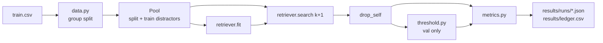

# Architecture

## Data flow



Evaluation matches **within a split**, like the competition: every listing in the split is both a query
and part of the candidate pool. The harness asks for `k + 1` results and removes each query from its own
list (`drop_self`), so metrics never count a listing matching itself as a retrieval success.

## The retriever contract

Every retriever implements two methods (`matchlens/retrievers/base.py`):

```python
def fit(self, corpus: pd.DataFrame) -> None: ...
def search(self, queries: pd.DataFrame, k: int) -> Candidates: ...
```

`Candidates` holds two `(n_queries, k)` arrays:

- `indices` — row positions into the fitted corpus, best first; `-1` where fewer than `k` exist.
- `scores` — **normalised per query**, so a single threshold means the same thing for every query.
  1.0 means "as similar as the query is to itself". `-inf` pads empty slots.

Normalisation matters because raw BM25 scores grow with title length and rare words: a threshold of 12
might be strict for one query and loose for another. Dividing by the query's self-score fixes that.
Cosine similarity (rungs 3–4) is already bounded and needs no extra step.

## Components

| Module | Rung | Notes |
|---|---|---|
| `text.py` | all | Decodes Shopee's literal `\xNN` byte escapes and HTML entities; lowercases; keeps alphanumeric runs whole (`a52`); glues units to numbers so `128 GB` and `128gb` are the same token |
| `retrievers/bm25.py` | 1 | Sparse-matrix BM25 (Lucene idf, `k1 = 1.2`, `b = 0.75`). Queries are scored in batches of 512 as one sparse × sparse product, then top-k via `argpartition` |
| `metrics.py` | all | See [evaluation.md](evaluation.md) |
| `threshold.py` | all | Grid search 0.00–1.00 in steps of 0.01 for best mean F1; ties go to the stricter threshold |
| `evaluate.py` | all | Config in, metrics out; test split locked behind `--unlock-test` |

Built: BM25 (1), canonical units (1b), phash near-dups (2), dense retrieval over FAISS/Qdrant stores (3).
Planned: image embeddings (4), fusion (5), reranker (6), fine-tuning (7), per-cluster thresholds (8), error-analysis view, demo app, API.

## Vector stores

Embedding vectors live in a vector store (`matchlens/stores.py`), which answers "which stored vectors
are closest to this one?". Text and image vectors are kept in **separate stores**: they come from
different models with different sizes and are tuned and replaced independently. Fusion (rung 5) asks
both and merges the answers.

| Data | Store | Why |
|---|---|---|
| Text vectors (rung 3+) | **FAISS** (`IndexFlatIP`, exact) | In-process library, the industry standard for fast similarity search. Index saved to disk and reused |
| Image vectors (rung 4+) | **Qdrant** (local mode) | A real vector database. Local mode is a folder on disk with no server; the same code can point at a Qdrant server later |
| Reference | numpy brute force | Exact answer that every store is tested against |

Measured on the 27,431 bge-m3 vectors (1024-d), 3,366 val queries, laptop CPU:

| Store | Build | Per query (batch) | Same top 50 as exact | F1 |
|---|---|---|---|---|
| numpy (exact) | 0.1 s | 0.7 ms | 100% | 0.6732 |
| FAISS flat (exact) | 0.7 s | 0.5 ms | 99.97% | 0.6732 |
| FAISS HNSW (approximate) | 6.6 s | 0.5 ms | 98.4% | 0.6731 |
| Qdrant local | 262 s | 163 ms | 99.7% (200-query sample) | — |

- **Exact vs approximate.** HNSW checks only part of the corpus via a graph, so it can miss a
  neighbour (98.4% overlap) — it pays off at millions of vectors, not 27k. Flat is used for now.
- **Qdrant local mode is slow at this size** (it warns above 20,000 points): fine for building once
  and evaluating, not for serving. A Qdrant server (Docker) builds an HNSW index and would be fast,
  but costs RAM this laptop does not have to spare.
- Both stores fingerprint their vectors and rebuild automatically if the pool changes (val vs test).

```toml
[retriever.store]
type = "faiss"          # or "qdrant" (path + collection) or "numpy"
index = "flat"          # or "hnsw"
path = "C:/data/shopee/stores/faiss_text_bge_m3.index"
```

## Adding a rung

1. Write a class with `name`, `fit` and `search` that returns normalised `Candidates`.
2. Register it in `REGISTRY` in `matchlens/retrievers/__init__.py`.
3. Add `configs/rungNN_<name>.toml`. Everything under `[retriever]` except `type` is passed to the
   constructor.
4. Run it on `val`, then add an entry to [ladder.md](ladder.md) with the hypothesis and the verdict.

## Config reference

```toml
name = "rung01_bm25"        # used for result file names; must be unique per rung
rung = 1

[data]
csv = "C:/data/shopee/train.csv"
split = "data/splits/split_v1.csv"

[retriever]
type = "bm25"               # key in REGISTRY
k1 = 1.2                    # any other keys go to the constructor
b = 0.75

[eval]
k = 50                      # candidates kept per query
distractors = ["train"]     # extra splits in the pool: retrievable, never queried (see evaluation.md)
latency_sample = 200        # queries timed one at a time for p50/p95

[cost]
usd_per_hour = 0.10         # assumed CPU price, used only for cost per 1k queries
```
