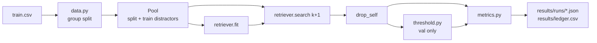

# Architecture

## Data flow



Evaluation matches **within a split**, like the competition: every listing in the split is both a query
and part of the candidate pool. The harness asks for `k + 1` results and removes each query from its own
list (`drop_self`), so metrics never count a listing matching itself as a retrieval success.

## The retriever contract

Every retriever implements two methods (`matchlens/retrievers/base.py`):

```python
def fit(self, corpus: pd.DataFrame) -> None: ...
def search(self, queries: pd.DataFrame, k: int) -> Candidates: ...
```

`Candidates` holds two `(n_queries, k)` arrays:

- `indices` — row positions into the fitted corpus, best first; `-1` where fewer than `k` exist.
- `scores` — **normalised per query**, so a single threshold means the same thing for every query.
  1.0 means "as similar as the query is to itself". `-inf` pads empty slots.

Normalisation matters because raw BM25 scores grow with title length and rare words: a threshold of 12
might be strict for one query and loose for another. Dividing by the query's self-score fixes that.
Cosine similarity (rungs 3–4) is already bounded and needs no extra step.

## Components

| Module | Rung | Notes |
|---|---|---|
| `text.py` | all | Decodes Shopee's literal `\xNN` byte escapes and HTML entities; lowercases; keeps alphanumeric runs whole (`a52`); glues units to numbers so `128 GB` and `128gb` are the same token |
| `retrievers/bm25.py` | 1 | Sparse-matrix BM25 (Lucene idf, `k1 = 1.2`, `b = 0.75`). Queries are scored in batches of 512 as one sparse × sparse product, then top-k via `argpartition` |
| `metrics.py` | all | See [evaluation.md](evaluation.md) |
| `threshold.py` | all | Grid search 0.00–1.00 in steps of 0.01 for best mean F1; ties go to the stricter threshold |
| `evaluate.py` | all | Config in, metrics out; test split locked behind `--unlock-test` |

Planned (not built yet): near-dup filter (rung 2), embedding retrievers with a vector cache (3–4),
fusion (5), reranker (6), fine-tuning (7), per-cluster thresholds (8), error-analysis view, demo app, API.

## Adding a rung

1. Write a class with `name`, `fit` and `search` that returns normalised `Candidates`.
2. Register it in `REGISTRY` in `matchlens/retrievers/__init__.py`.
3. Add `configs/rungNN_<name>.toml`. Everything under `[retriever]` except `type` is passed to the
   constructor.
4. Run it on `val`, then add an entry to [ladder.md](ladder.md) with the hypothesis and the verdict.

## Config reference

```toml
name = "rung01_bm25"        # used for result file names; must be unique per rung
rung = 1

[data]
csv = "C:/data/shopee/train.csv"
split = "data/splits/split_v1.csv"

[retriever]
type = "bm25"               # key in REGISTRY
k1 = 1.2                    # any other keys go to the constructor
b = 0.75

[eval]
k = 50                      # candidates kept per query
distractors = ["train"]     # extra splits in the pool: retrievable, never queried (see evaluation.md)
latency_sample = 200        # queries timed one at a time for p50/p95

[cost]
usd_per_hour = 0.10         # assumed CPU price, used only for cost per 1k queries
```
